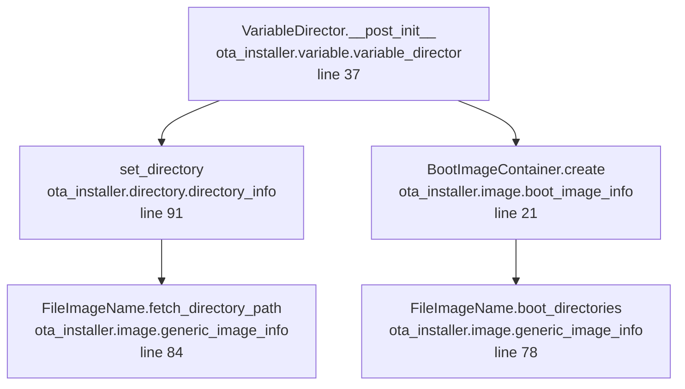

# Static Python call graph

```mermaid
flowchart TD
    node_0["set_directory<br/>ota_installer.directory.directory_info<br/>line 91"]
    node_1["BootImageContainer.create<br/>ota_installer.image.boot_image_info<br/>line 21"]
    node_2["FileImageName.boot_directories<br/>ota_installer.image.generic_image_info<br/>line 78"]
    node_3["FileImageName.fetch_directory_path<br/>ota_installer.image.generic_image_info<br/>line 84"]
    node_4["VariableDirector.__post_init__<br/>ota_installer.variable.variable_director<br/>line 37"]
    node_0 --> node_3
    node_1 --> node_2
    node_4 --> node_0
    node_4 --> node_1
```
